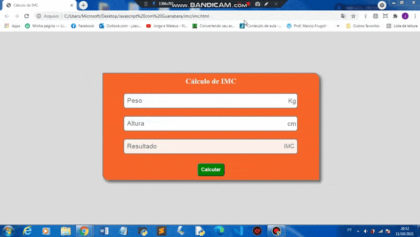

# Calculadora IMC com Javascript

### Esse projeto, é uma página feita com HTML5, CSS3 e JS. CSS3 para a estilização e responsividade, e Javascript para as funcionalidades da Calculadora.

### Sobre a Calculadora:

* Se o usuário não preencher o Peso ou a Altura, irá aparecer uma mensagem, pedindo para digitar ambas.
* Possui um limite para números inteiros, não permite a inserção de um número maior que o limite estabelecido.
* Caso o usuário, digite um número flutuante com mais de duas casas decimais, serão ignoradas todas as casas decimais que vem depois da segunda.
* Mostra exatamente o IMC do Usuário, dentro do input Resultado.
* E mostra a classificação do usuário, de acordo, com o resultado do Cálculo IMC.

### Versão Mobile:

### Versão Desktop:

### Experimente você mesmo !

* [Acesso a Calculadora](https://joao3872.github.io/Calculadora_IMC_com_Javascript/)
