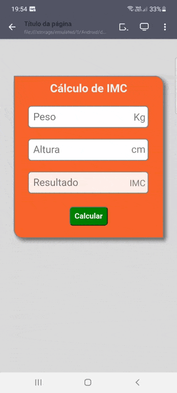
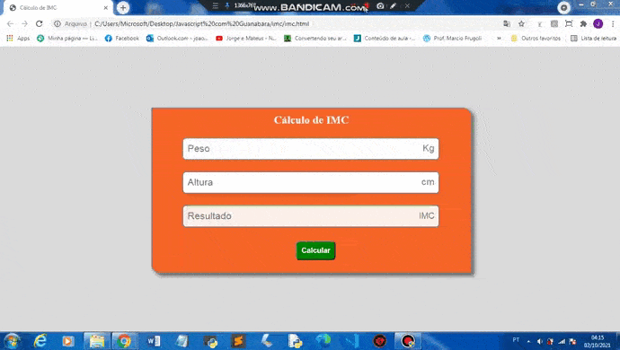

# Calculadora IMC com Javascript

### Esse projeto, é uma página feita com HTML5, CSS3 e JS. CSS3 para a estilização e responsividade, e Javascript para as funcionalidades da Calculadora.

### Sobre a Calculadora:

* Se o usuário não preencher o Peso ou a Altura, irá aparecer uma mensagem, pedindo para digitar ambas.
* Mostra exatamente o IMC do Usuário, dentro do input Resultado.
* E mostra a classificação do usuário, de acordo, com o resultado do Cálculo IMC.

### Versão Mobile:

 

### Versão Desktop:

